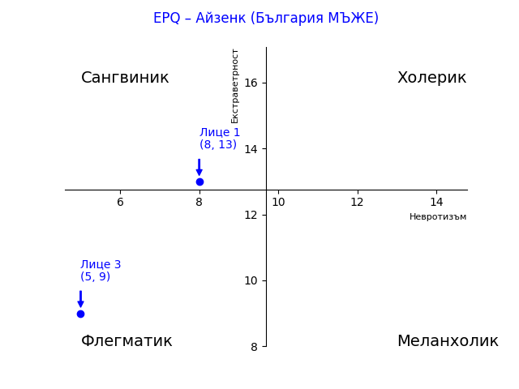
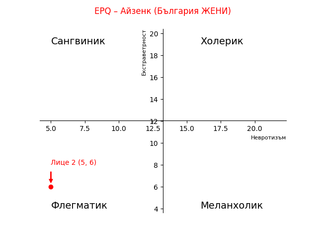

# Python скрип за чертане на Айзенк квадрантите и визуализация на данните от теста за личността на Ейзенк.

Това репозитори съдържа python скрипт, който чете данните от теста за личността на Айзенк и чертае графика на квадрантите на Ейзенк.

Има възможност за задаване на референтни стойности за - екстраверсия и невротицизъм. Генерираната графика показва къде се намират профилите на хората от теста в сравнение с четирите темперамента - сангвиник, холерик, меланхолик и флегматик.

Използвана библиотека - https://matplotlib.org/stable/

## Инструкции за използване
```bash
# Създаване на виртуална среда
virtualenv -p python3 .venv
source .venv/bin/activate

# Инсталиране на зависимостите
pip install -r requirements.txt

# Конфигуриране на скрипта:
#   Отворете файла aysenc.py и променете стойностите на променливите

# Стартиране на скрипта
python ./aysenc-men.py
python ./aysenc-women.py
```

# Генерирани графики:


